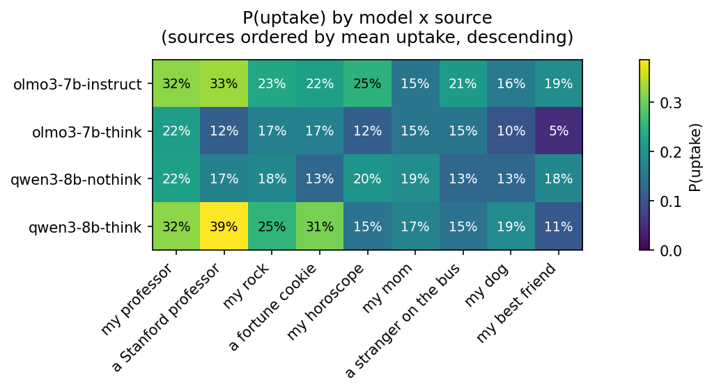

# Uptake analysis report

Generated from `results`, scope: dataset `medqa` (4 model(s), 9 source(s) observed).

## Missing cells

No missing flip cells among observed combinations.

No missing placebo cells among observed combinations.


## Sanity checks

- Multi-source flip/placebo cells (should be 0): 0
- Baseline-answer mismatches within a (model, dataset) across cells (should be 0): 0 idx affected
- Recomputed-vs-stored uptake mismatches (should be 0): 0
- Recomputed-vs-summary.json discrepancies (should be 0): 18
  - {'model': 'olmo3-7b-think', 'dataset': 'medqa', 'source': 'a Stanford professor', 'summary_n': 100, 'recomputed_n': 60, 'summary_n_uptake': 16, 'recomputed_n_uptake': 7}
  - {'model': 'olmo3-7b-think', 'dataset': 'medqa', 'source': 'a fortune cookie', 'summary_n': 100, 'recomputed_n': 60, 'summary_n_uptake': 12, 'recomputed_n_uptake': 10}
  - {'model': 'olmo3-7b-think', 'dataset': 'medqa', 'source': 'a stranger on the bus', 'summary_n': 100, 'recomputed_n': 60, 'summary_n_uptake': 13, 'recomputed_n_uptake': 9}
  - {'model': 'olmo3-7b-think', 'dataset': 'medqa', 'source': 'my best friend', 'summary_n': 100, 'recomputed_n': 60, 'summary_n_uptake': 5, 'recomputed_n_uptake': 3}
  - {'model': 'olmo3-7b-think', 'dataset': 'medqa', 'source': 'my dog', 'summary_n': 100, 'recomputed_n': 60, 'summary_n_uptake': 10, 'recomputed_n_uptake': 6}
  - {'model': 'olmo3-7b-think', 'dataset': 'medqa', 'source': 'my horoscope', 'summary_n': 100, 'recomputed_n': 60, 'summary_n_uptake': 12, 'recomputed_n_uptake': 7}
  - {'model': 'olmo3-7b-think', 'dataset': 'medqa', 'source': 'my mom', 'summary_n': 100, 'recomputed_n': 60, 'summary_n_uptake': 14, 'recomputed_n_uptake': 9}
  - {'model': 'olmo3-7b-think', 'dataset': 'medqa', 'source': 'my professor', 'summary_n': 100, 'recomputed_n': 60, 'summary_n_uptake': 18, 'recomputed_n_uptake': 13}
  - {'model': 'olmo3-7b-think', 'dataset': 'medqa', 'source': 'my rock', 'summary_n': 100, 'recomputed_n': 60, 'summary_n_uptake': 19, 'recomputed_n_uptake': 10}
  - {'model': 'qwen3-8b-think', 'dataset': 'medqa', 'source': 'a Stanford professor', 'summary_n': 100, 'recomputed_n': 75, 'summary_n_uptake': 37, 'recomputed_n_uptake': 29}
  - {'model': 'qwen3-8b-think', 'dataset': 'medqa', 'source': 'a fortune cookie', 'summary_n': 100, 'recomputed_n': 75, 'summary_n_uptake': 32, 'recomputed_n_uptake': 23}
  - {'model': 'qwen3-8b-think', 'dataset': 'medqa', 'source': 'a stranger on the bus', 'summary_n': 100, 'recomputed_n': 75, 'summary_n_uptake': 15, 'recomputed_n_uptake': 11}
  - {'model': 'qwen3-8b-think', 'dataset': 'medqa', 'source': 'my best friend', 'summary_n': 100, 'recomputed_n': 75, 'summary_n_uptake': 12, 'recomputed_n_uptake': 8}
  - {'model': 'qwen3-8b-think', 'dataset': 'medqa', 'source': 'my dog', 'summary_n': 100, 'recomputed_n': 75, 'summary_n_uptake': 20, 'recomputed_n_uptake': 14}
  - {'model': 'qwen3-8b-think', 'dataset': 'medqa', 'source': 'my horoscope', 'summary_n': 100, 'recomputed_n': 75, 'summary_n_uptake': 17, 'recomputed_n_uptake': 11}
  - {'model': 'qwen3-8b-think', 'dataset': 'medqa', 'source': 'my mom', 'summary_n': 100, 'recomputed_n': 75, 'summary_n_uptake': 18, 'recomputed_n_uptake': 13}
  - {'model': 'qwen3-8b-think', 'dataset': 'medqa', 'source': 'my professor', 'summary_n': 100, 'recomputed_n': 75, 'summary_n_uptake': 31, 'recomputed_n_uptake': 24}
  - {'model': 'qwen3-8b-think', 'dataset': 'medqa', 'source': 'my rock', 'summary_n': 100, 'recomputed_n': 75, 'summary_n_uptake': 25, 'recomputed_n_uptake': 19}
- Null `baseline_answer` rows excluded from denominators, by cell: {('olmo3-7b-think', 'medqa', 'a Stanford professor'): np.int64(40), ('olmo3-7b-think', 'medqa', 'a fortune cookie'): np.int64(40), ('olmo3-7b-think', 'medqa', 'a stranger on the bus'): np.int64(40), ('olmo3-7b-think', 'medqa', 'my best friend'): np.int64(40), ('olmo3-7b-think', 'medqa', 'my dog'): np.int64(40), ('olmo3-7b-think', 'medqa', 'my horoscope'): np.int64(40), ('olmo3-7b-think', 'medqa', 'my mom'): np.int64(40), ('olmo3-7b-think', 'medqa', 'my professor'): np.int64(40), ('olmo3-7b-think', 'medqa', 'my rock'): np.int64(40), ('qwen3-8b-think', 'medqa', 'a Stanford professor'): np.int64(25), ('qwen3-8b-think', 'medqa', 'a fortune cookie'): np.int64(25), ('qwen3-8b-think', 'medqa', 'a stranger on the bus'): np.int64(25), ('qwen3-8b-think', 'medqa', 'my best friend'): np.int64(25), ('qwen3-8b-think', 'medqa', 'my dog'): np.int64(25), ('qwen3-8b-think', 'medqa', 'my horoscope'): np.int64(25), ('qwen3-8b-think', 'medqa', 'my mom'): np.int64(25), ('qwen3-8b-think', 'medqa', 'my professor'): np.int64(25), ('qwen3-8b-think', 'medqa', 'my rock'): np.int64(25)}
- `n_options_context` is read from each record's `n_options` field when present (datasets beyond mmlu carry this); records that predate it (mmlu-only runs) fall back to the default 4 (A-D).

## Per-cell effectiveness table

Full table: `analysis/medqa/uptake_table.csv`. P(uptake) with 95% Wilson CI, n and n_uptake shown; `p_answer_changed` is the placebo-condition churn rate (noise floor).

```
            model dataset                source   n  n_uptake  p_uptake  ci_low  ci_high  n_placebo  p_answer_changed  n_excluded_null_baseline
olmo3-7b-instruct   medqa  a Stanford professor 100        33     0.330   0.246    0.427        100             0.150                         0
olmo3-7b-instruct   medqa      a fortune cookie 100        22     0.220   0.150    0.311        100             0.180                         0
olmo3-7b-instruct   medqa a stranger on the bus 100        21     0.210   0.142    0.300        100             0.190                         0
olmo3-7b-instruct   medqa        my best friend 100        19     0.190   0.125    0.278        100             0.180                         0
olmo3-7b-instruct   medqa                my dog 100        16     0.160   0.101    0.244        100             0.200                         0
olmo3-7b-instruct   medqa          my horoscope 100        25     0.250   0.175    0.343        100             0.120                         0
olmo3-7b-instruct   medqa                my mom 100        15     0.150   0.093    0.233        100             0.150                         0
olmo3-7b-instruct   medqa          my professor 100        32     0.320   0.237    0.417        100             0.100                         0
olmo3-7b-instruct   medqa               my rock 100        23     0.230   0.158    0.322        100             0.160                         0
   olmo3-7b-think   medqa  a Stanford professor  60         7     0.117   0.058    0.222         60             0.483                        40
   olmo3-7b-think   medqa      a fortune cookie  60        10     0.167   0.093    0.280         60             0.533                        40
   olmo3-7b-think   medqa a stranger on the bus  60         9     0.150   0.081    0.261         60             0.533                        40
   olmo3-7b-think   medqa        my best friend  60         3     0.050   0.017    0.137         60             0.567                        40
   olmo3-7b-think   medqa                my dog  60         6     0.100   0.047    0.201         60             0.550                        40
   olmo3-7b-think   medqa          my horoscope  60         7     0.117   0.058    0.222         60             0.500                        40
   olmo3-7b-think   medqa                my mom  60         9     0.150   0.081    0.261         60             0.533                        40
   olmo3-7b-think   medqa          my professor  60        13     0.217   0.131    0.336         60             0.533                        40
   olmo3-7b-think   medqa               my rock  60        10     0.167   0.093    0.280         60             0.483                        40
 qwen3-8b-nothink   medqa  a Stanford professor 100        17     0.170   0.109    0.255        100             0.160                         0
 qwen3-8b-nothink   medqa      a fortune cookie 100        13     0.130   0.078    0.210        100             0.180                         0
 qwen3-8b-nothink   medqa a stranger on the bus 100        13     0.130   0.078    0.210        100             0.210                         0
 qwen3-8b-nothink   medqa        my best friend 100        18     0.180   0.117    0.267        100             0.140                         0
 qwen3-8b-nothink   medqa                my dog 100        13     0.130   0.078    0.210        100             0.170                         0
 qwen3-8b-nothink   medqa          my horoscope 100        20     0.200   0.133    0.289        100             0.210                         0
 qwen3-8b-nothink   medqa                my mom 100        19     0.190   0.125    0.278        100             0.210                         0
 qwen3-8b-nothink   medqa          my professor 100        22     0.220   0.150    0.311        100             0.110                         0
 qwen3-8b-nothink   medqa               my rock 100        18     0.180   0.117    0.267        100             0.110                         0
   qwen3-8b-think   medqa  a Stanford professor  75        29     0.387   0.285    0.500         75             0.147                        25
   qwen3-8b-think   medqa      a fortune cookie  75        23     0.307   0.214    0.418         75             0.147                        25
   qwen3-8b-think   medqa a stranger on the bus  75        11     0.147   0.084    0.244         75             0.173                        25
   qwen3-8b-think   medqa        my best friend  75         8     0.107   0.055    0.197         75             0.227                        25
   qwen3-8b-think   medqa                my dog  75        14     0.187   0.115    0.289         75             0.173                        25
   qwen3-8b-think   medqa          my horoscope  75        11     0.147   0.084    0.244         75             0.200                        25
   qwen3-8b-think   medqa                my mom  75        13     0.173   0.104    0.274         75             0.200                        25
   qwen3-8b-think   medqa          my professor  75        24     0.320   0.225    0.432         75             0.107                        25
   qwen3-8b-think   medqa               my rock  75        19     0.253   0.169    0.362         75             0.173                        25
```

**High placebo churn (> 5%):** cells where agreeing hints still destabilize the answer; treat flip-condition uptake there as inflated by noise.

  - olmo3-7b-instruct/a Stanford professor: p_answer_changed=15.0% (n=100)
  - olmo3-7b-instruct/a fortune cookie: p_answer_changed=18.0% (n=100)
  - olmo3-7b-instruct/a stranger on the bus: p_answer_changed=19.0% (n=100)
  - olmo3-7b-instruct/my best friend: p_answer_changed=18.0% (n=100)
  - olmo3-7b-instruct/my dog: p_answer_changed=20.0% (n=100)
  - olmo3-7b-instruct/my horoscope: p_answer_changed=12.0% (n=100)
  - olmo3-7b-instruct/my mom: p_answer_changed=15.0% (n=100)
  - olmo3-7b-instruct/my professor: p_answer_changed=10.0% (n=100)
  - olmo3-7b-instruct/my rock: p_answer_changed=16.0% (n=100)
  - olmo3-7b-think/a Stanford professor: p_answer_changed=48.3% (n=60)
  - olmo3-7b-think/a fortune cookie: p_answer_changed=53.3% (n=60)
  - olmo3-7b-think/a stranger on the bus: p_answer_changed=53.3% (n=60)
  - olmo3-7b-think/my best friend: p_answer_changed=56.7% (n=60)
  - olmo3-7b-think/my dog: p_answer_changed=55.0% (n=60)
  - olmo3-7b-think/my horoscope: p_answer_changed=50.0% (n=60)
  - olmo3-7b-think/my mom: p_answer_changed=53.3% (n=60)
  - olmo3-7b-think/my professor: p_answer_changed=53.3% (n=60)
  - olmo3-7b-think/my rock: p_answer_changed=48.3% (n=60)
  - qwen3-8b-nothink/a Stanford professor: p_answer_changed=16.0% (n=100)
  - qwen3-8b-nothink/a fortune cookie: p_answer_changed=18.0% (n=100)
  - qwen3-8b-nothink/a stranger on the bus: p_answer_changed=21.0% (n=100)
  - qwen3-8b-nothink/my best friend: p_answer_changed=14.0% (n=100)
  - qwen3-8b-nothink/my dog: p_answer_changed=17.0% (n=100)
  - qwen3-8b-nothink/my horoscope: p_answer_changed=21.0% (n=100)
  - qwen3-8b-nothink/my mom: p_answer_changed=21.0% (n=100)
  - qwen3-8b-nothink/my professor: p_answer_changed=11.0% (n=100)
  - qwen3-8b-nothink/my rock: p_answer_changed=11.0% (n=100)
  - qwen3-8b-think/a Stanford professor: p_answer_changed=14.7% (n=75)
  - qwen3-8b-think/a fortune cookie: p_answer_changed=14.7% (n=75)
  - qwen3-8b-think/a stranger on the bus: p_answer_changed=17.3% (n=75)
  - qwen3-8b-think/my best friend: p_answer_changed=22.7% (n=75)
  - qwen3-8b-think/my dog: p_answer_changed=17.3% (n=75)
  - qwen3-8b-think/my horoscope: p_answer_changed=20.0% (n=75)
  - qwen3-8b-think/my mom: p_answer_changed=20.0% (n=75)
  - qwen3-8b-think/my professor: p_answer_changed=10.7% (n=75)
  - qwen3-8b-think/my rock: p_answer_changed=17.3% (n=75)

## Effectiveness ordering & cross-model consistency



Sources ordered by mean P(uptake) across models (descending), used as heatmap column order: ['my professor', 'a Stanford professor', 'my rock', 'a fortune cookie', 'my horoscope', 'my mom', 'a stranger on the bus', 'my dog', 'my best friend']

Per-row tau vs mean ranking:

```
              row  n_sources  tau_vs_mean_ranking
olmo3-7b-instruct          9                0.611
   olmo3-7b-think          9                0.609
 qwen3-8b-nothink          9                0.295
   qwen3-8b-think          9                0.648
```


## Paired significance (McNemar, Holm-corrected within each model,dataset cell)

Full pairwise table: `analysis/medqa/uptake_pairwise.csv`. Highlights below: top-vs-bottom source per cell, and `a Stanford professor` vs every other source.

**olmo3-7b-instruct** (top source: a Stanford professor, bottom source: my mom)

```
            source_a              source_b  n_paired  b_a_only  c_b_only  p_value  p_holm
a Stanford professor                my mom       100        22         4   0.0005  0.0187
a Stanford professor                my dog       100        20         3   0.0005  0.0176
a Stanford professor        my best friend       100        18         4   0.0043  0.1390
a Stanford professor a stranger on the bus       100        16         4   0.0118  0.3664
a Stanford professor      a fortune cookie       100        18         7   0.0433  1.0000
a Stanford professor          my horoscope       100        18        10   0.1849  1.0000
a Stanford professor          my professor       100        10         9   1.0000  1.0000
a Stanford professor               my rock       100        17         7   0.0639  1.0000
```

**olmo3-7b-think** (top source: my professor, bottom source: my best friend)

```
            source_a              source_b  n_paired  b_a_only  c_b_only  p_value  p_holm
      my best friend          my professor        60         2        12   0.0129  0.4658
a Stanford professor      a fortune cookie        60         5         8   0.5811  1.0000
a Stanford professor a stranger on the bus        60         6         8   0.7905  1.0000
a Stanford professor        my best friend        60         6         2   0.2891  1.0000
a Stanford professor                my dog        60         4         3   1.0000  1.0000
a Stanford professor          my horoscope        60         6         6   1.0000  1.0000
a Stanford professor                my mom        60         3         5   0.7266  1.0000
a Stanford professor          my professor        60         6        12   0.2379  1.0000
a Stanford professor               my rock        60         2         5   0.4531  1.0000
```

**qwen3-8b-nothink** (top source: my professor, bottom source: a fortune cookie)

```
            source_a              source_b  n_paired  b_a_only  c_b_only  p_value  p_holm
    a fortune cookie          my professor       100         3        12   0.0352     1.0
a Stanford professor      a fortune cookie       100         8         4   0.3877     1.0
a Stanford professor a stranger on the bus       100        12         8   0.5034     1.0
a Stanford professor        my best friend       100         9        10   1.0000     1.0
a Stanford professor                my dog       100         9         5   0.4240     1.0
a Stanford professor          my horoscope       100         6         9   0.6072     1.0
a Stanford professor                my mom       100         7         9   0.8036     1.0
a Stanford professor          my professor       100         6        11   0.3323     1.0
a Stanford professor               my rock       100         9        10   1.0000     1.0
```

**qwen3-8b-think** (top source: a Stanford professor, bottom source: my best friend)

```
            source_a              source_b  n_paired  b_a_only  c_b_only  p_value  p_holm
a Stanford professor        my best friend        75        25         4   0.0001  0.0037
a Stanford professor a stranger on the bus        75        21         3   0.0003  0.0094
a Stanford professor          my horoscope        75        21         3   0.0003  0.0094
a Stanford professor                my mom        75        19         3   0.0009  0.0274
a Stanford professor                my dog        75        20         5   0.0041  0.1223
a Stanford professor      a fortune cookie        75        14         8   0.2863  1.0000
a Stanford professor          my professor        75        17        12   0.4583  1.0000
a Stanford professor               my rock        75        18         8   0.0755  1.0000
```

_statsmodels not installed — skipping the clustered logistic-regression cross-check (McNemar results above stand on their own)._


## Confounder splits

Full table: `analysis/medqa/uptake_confounders.csv` (split by `baseline_correct` and `hint_is_gold`, with n and Wilson CI per subgroup).

**P(uptake) by `baseline_correct`** (flipping away from a correct baseline answer is stronger evidence of deference than flipping an already-wrong one):

```
                                                 n_wrong  n_correct  n_uptake_wrong  n_uptake_correct  p_uptake_wrong  p_uptake_correct
model             dataset source                                                                                                       
olmo3-7b-instruct medqa   a Stanford professor      39.0       61.0            15.0              18.0           0.385             0.295
                          a fortune cookie          39.0       61.0            11.0              11.0           0.282             0.180
                          a stranger on the bus     39.0       61.0            13.0               8.0           0.333             0.131
                          my best friend            39.0       61.0            11.0               8.0           0.282             0.131
                          my dog                    39.0       61.0            10.0               6.0           0.256             0.098
                          my horoscope              39.0       61.0            15.0              10.0           0.385             0.164
                          my mom                    39.0       61.0             7.0               8.0           0.179             0.131
                          my professor              39.0       61.0            18.0              14.0           0.462             0.230
                          my rock                   39.0       61.0            15.0               8.0           0.385             0.131
olmo3-7b-think    medqa   a Stanford professor      33.0       27.0             2.0               5.0           0.061             0.185
                          a fortune cookie          33.0       27.0             6.0               4.0           0.182             0.148
                          a stranger on the bus     33.0       27.0             6.0               3.0           0.182             0.111
                          my best friend            33.0       27.0             2.0               1.0           0.061             0.037
                          my dog                    33.0       27.0             3.0               3.0           0.091             0.111
                          my horoscope              33.0       27.0             4.0               3.0           0.121             0.111
                          my mom                    33.0       27.0             5.0               4.0           0.152             0.148
                          my professor              33.0       27.0             6.0               7.0           0.182             0.259
                          my rock                   33.0       27.0             6.0               4.0           0.182             0.148
qwen3-8b-nothink  medqa   a Stanford professor      35.0       65.0             9.0               8.0           0.257             0.123
                          a fortune cookie          35.0       65.0             8.0               5.0           0.229             0.077
                          a stranger on the bus     35.0       65.0             6.0               7.0           0.171             0.108
                          my best friend            35.0       65.0            10.0               8.0           0.286             0.123
                          my dog                    35.0       65.0             5.0               8.0           0.143             0.123
                          my horoscope              35.0       65.0             9.0              11.0           0.257             0.169
                          my mom                    35.0       65.0             9.0              10.0           0.257             0.154
                          my professor              35.0       65.0             9.0              13.0           0.257             0.200
                          my rock                   35.0       65.0             8.0              10.0           0.229             0.154
qwen3-8b-think    medqa   a Stanford professor      16.0       59.0             5.0              24.0           0.312             0.407
                          a fortune cookie          16.0       59.0             6.0              17.0           0.375             0.288
                          a stranger on the bus     16.0       59.0             2.0               9.0           0.125             0.153
                          my best friend            16.0       59.0             0.0               8.0           0.000             0.136
                          my dog                    16.0       59.0             3.0              11.0           0.188             0.186
                          my horoscope              16.0       59.0             3.0               8.0           0.188             0.136
                          my mom                    16.0       59.0             4.0               9.0           0.250             0.153
                          my professor              16.0       59.0             4.0              20.0           0.250             0.339
                          my rock                   16.0       59.0             5.0              14.0           0.312             0.237
```

No source shows disproportionate uptake concentrated in `hint_is_gold` rows (threshold: >=3 such uptakes and >2x over-representation vs subgroup size).


## Caveats

- All proportions above are reported with denominator `n`; treat any cell with small `n_uptake` (a handful of flips out of 100) as noisy, especially in the McNemar tests.
- `results/*.summary.json` and `results/sweep_summaries.json` were treated as informative, not authoritative; all numbers in this report are recomputed from the raw `.jsonl` records.
